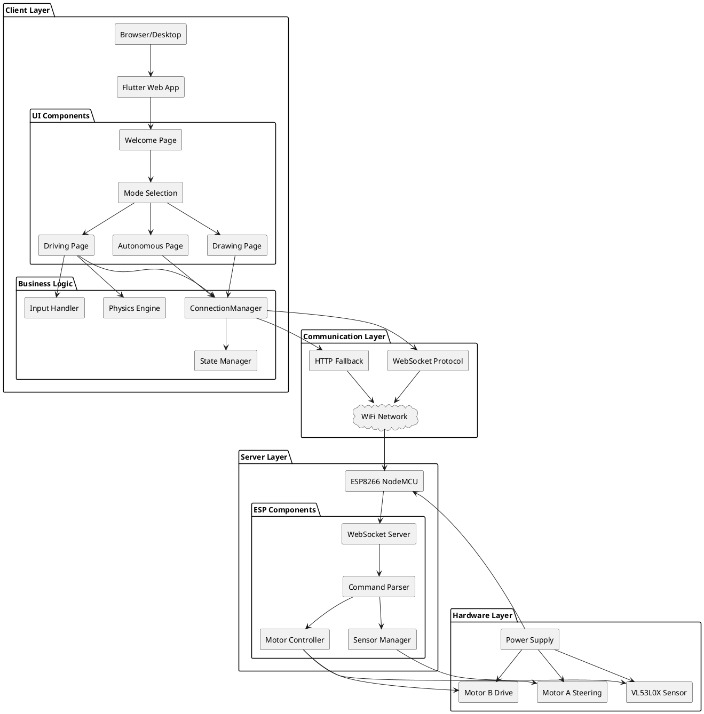
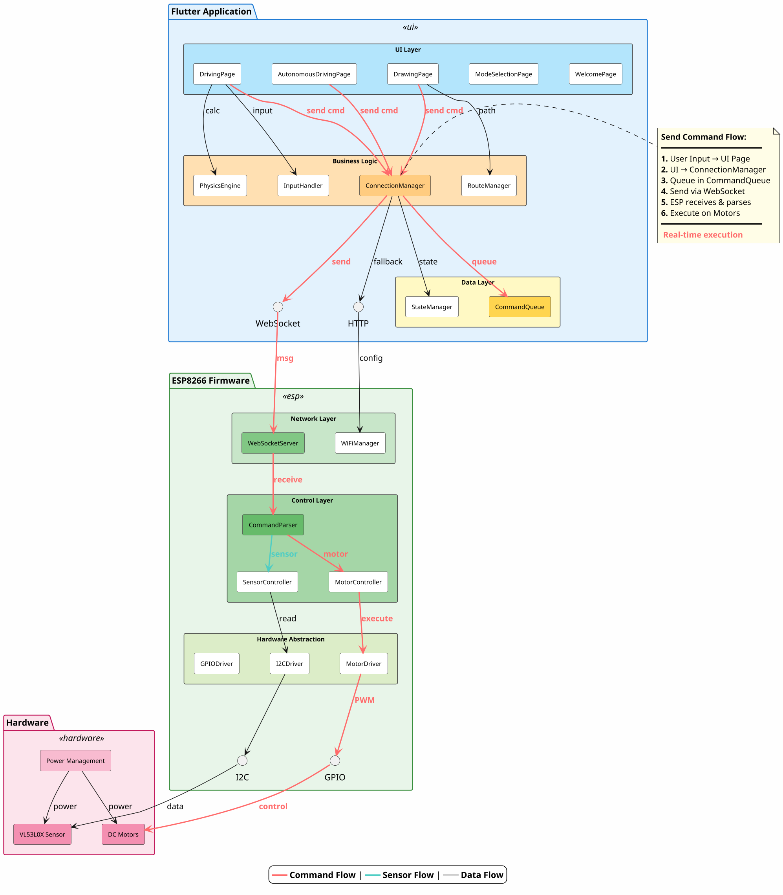
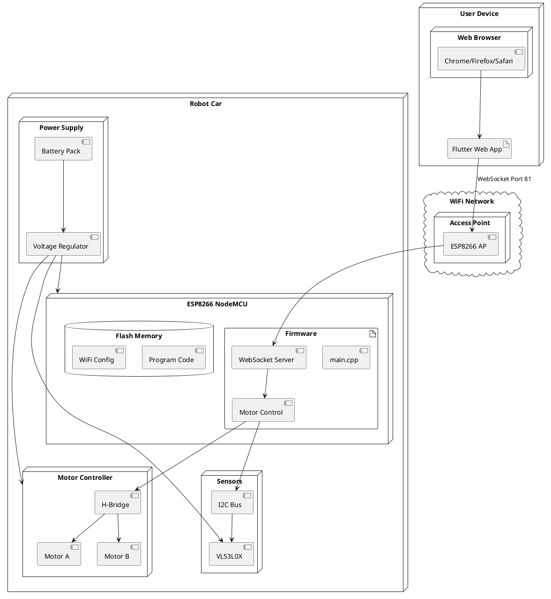
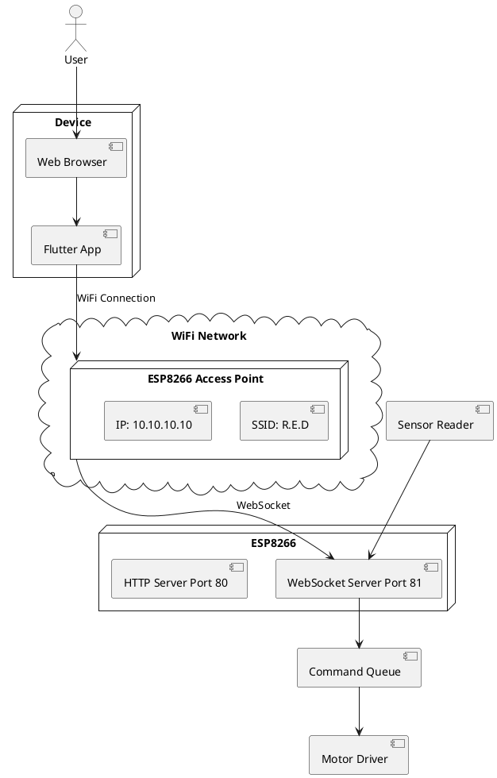
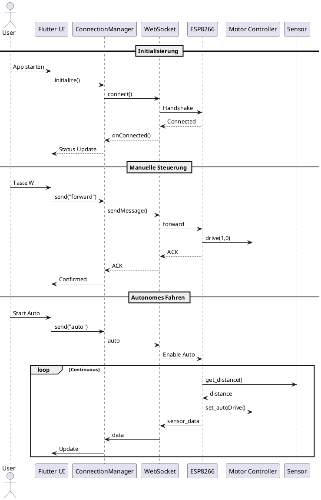

# Systemarchitektur - R.E.D. Projekt (Korrigierte Version)

## Inhaltsverzeichnis
- [Übersicht](#übersicht)
- [Systemarchitektur-Diagramm](#systemarchitektur-diagramm)
- [Komponentendiagramm](#komponentendiagramm)
- [Deployment-Diagramm](#deployment-diagramm)
- [Netzwerkarchitektur](#netzwerkarchitektur)

## Übersicht

Das R.E.D. System folgt einer **Client-Server-Architektur** mit Echtzeit-Kommunikation über WebSockets. Die Architektur ist in drei Hauptschichten unterteilt:

1. **Präsentationsschicht** (Flutter Web App)
2. **Kommunikationsschicht** (WebSocket/HTTP)
3. **Steuerungsschicht** (ESP8266 + Hardware)

## Systemarchitektur-Diagramm



## Komponentendiagramm



## Deployment-Diagramm



## Netzwerkarchitektur



## Datenfluss-Diagramm



## Schichtenarchitektur

### Layer 1: Präsentationsschicht (Flutter)
- **Verantwortung**: UI/UX, Benutzereingaben, Visualisierung
- **Technologien**: Flutter, Dart, Material Design
- **Komponenten**: Pages, Widgets, Custom Painters

### Layer 2: Business Logic
- **Verantwortung**: Anwendungslogik, State Management, Physik-Simulation
- **Technologien**: Dart, Timer, ValueNotifier
- **Komponenten**: ConnectionManager, PhysicsEngine, InputHandler

### Layer 3: Kommunikationsschicht
- **Verantwortung**: Netzwerkkommunikation, Protokoll-Handling
- **Technologien**: WebSocket, HTTP
- **Komponenten**: WebSocketChannel, HTTP Client

### Layer 4: Steuerungsschicht (ESP8266)
- **Verantwortung**: Hardware-Steuerung, Sensor-Auswertung
- **Technologien**: Arduino, C++
- **Komponenten**: WebSocketServer, Motor Driver, Sensor Manager

### Layer 5: Hardware-Schicht
- **Verantwortung**: Physische Aktoren und Sensoren
- **Technologien**: DC-Motoren, ToF-Sensor, I2C
- **Komponenten**: Motors, VL53L0X, Power Supply

## Design Patterns

### 1. Singleton Pattern
**Verwendung**: ConnectionManager
```dart
class ConnectionManager {
  ConnectionManager._internal();
  static final ConnectionManager instance = ConnectionManager._internal();
}
```

### 2. Observer Pattern
**Verwendung**: ValueNotifier für Verbindungsstatus
```dart
ValueNotifier<bool> connected = ValueNotifier(false);
```

### 3. State Pattern
**Verwendung**: StatefulWidget für dynamische Pages

### 4. Command Pattern
**Verwendung**: Motor-Befehle

## Performance-Metriken

| Metrik | Zielwert | Aktuell | Status |
|--------|----------|---------|--------|
| WebSocket Latenz | <100ms | 50-100ms | ✅ |
| UI Frame Rate | 60 FPS | 60 FPS | ✅ |
| Physics Update Rate | 20 FPS | 20 FPS | ✅ |
| Reconnect Time | <3s | 1-5s | ⚠️ |
| Command Queue Size | <10 | 5 | ✅ |

---

**Letzte Aktualisierung**: 2026-05-26