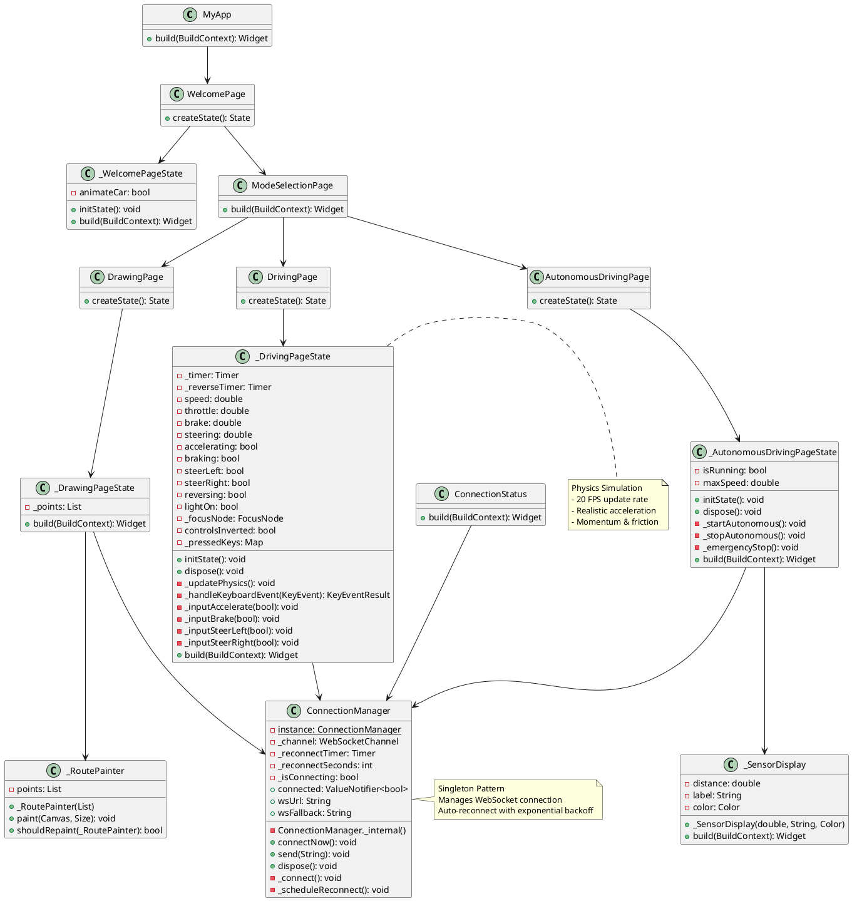
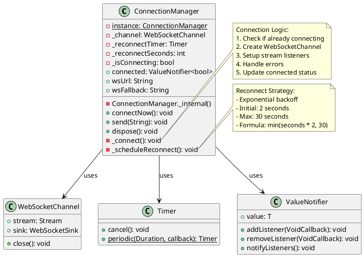
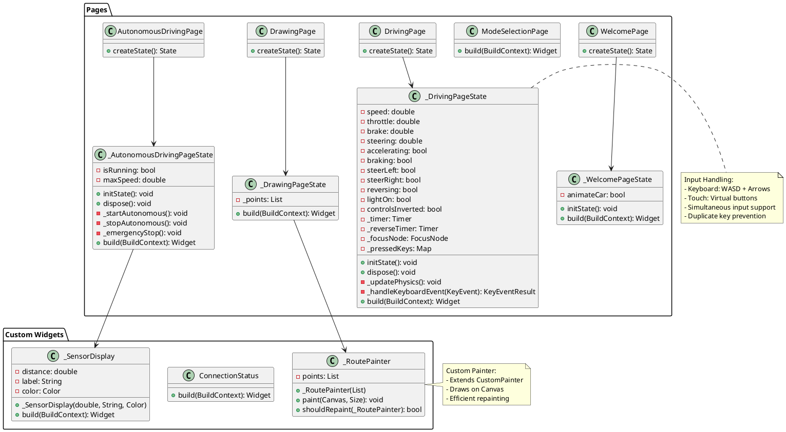
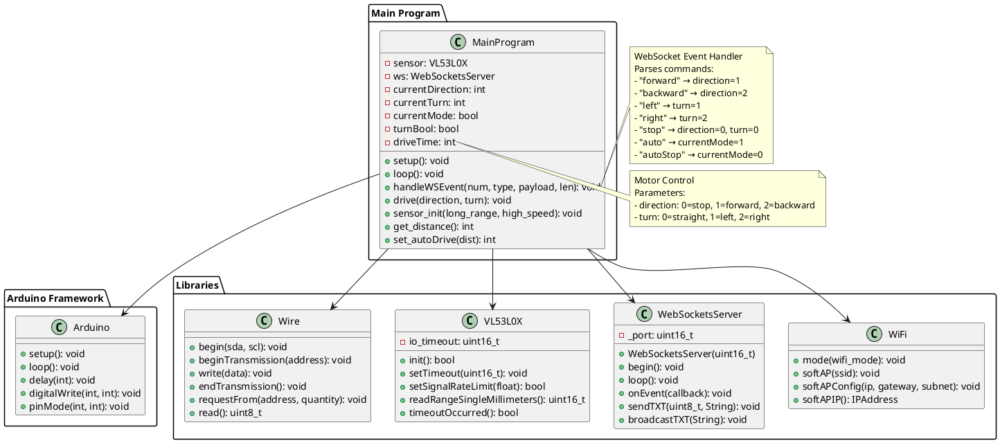
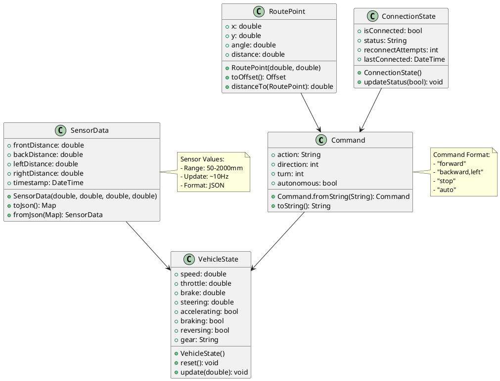
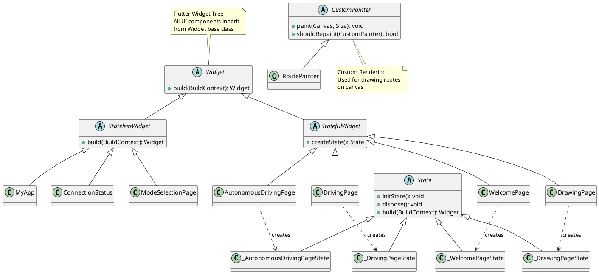

# Klassendiagramme - R.E.D. Projekt (Korrigierte Version)

## Inhaltsverzeichnis
- [Flutter App - Vollständiges Klassendiagramm](#flutter-app---vollständiges-klassendiagramm)
- [ConnectionManager - Detailansicht](#connectionmanager---detailansicht)
- [UI-Komponenten](#ui-komponenten)
- [ESP8266 Firmware - Klassenstruktur](#esp8266-firmware---klassenstruktur)

## Flutter App - Vollständiges Klassendiagramm

## ConnectionManager - Detailansicht

## UI-Komponenten

## ESP8266 Firmware - Klassenstruktur

## Datenmodelle

## Vererbungshierarchie

---

**Letzte Aktualisierung**: 2026-05-26