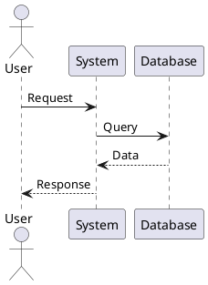

# 🎨 PlantUML Diagramme anzeigen - Schritt-für-Schritt Anleitung

## Methode 1: VS Code Extension (Empfohlen) ⭐

### Schritt 1: Extension installieren

1. **Öffne VS Code**
2. **Klicke auf Extensions** (oder drücke `Ctrl+Shift+X` / `Cmd+Shift+X`)
3. **Suche nach**: `PlantUML`
4. **Installiere**: "PlantUML" von **jebbs** (der mit den meisten Downloads)


### Schritt 2: Java installieren (falls nicht vorhanden)

PlantUML benötigt Java zum Rendern der Diagramme.

**Prüfen ob Java installiert ist:**
```bash
java -version
```

**Falls nicht installiert:**

**Windows:**
1. Gehe zu: https://www.oracle.com/java/technologies/downloads/
2. Lade "Java SE Development Kit" herunter
3. Installiere es
4. Starte VS Code neu

**macOS:**
```bash
brew install openjdk
```

**Linux:**
```bash
sudo apt install default-jdk
```

### Schritt 3: Graphviz installieren (optional, aber empfohlen)

Für bessere Diagramm-Layouts:

**Windows:**
1. Gehe zu: https://graphviz.org/download/
2. Lade Windows-Installer herunter
3. Installiere es
4. Füge zu PATH hinzu (Installer macht das automatisch)

**macOS:**
```bash
brew install graphviz
```

**Linux:**
```bash
sudo apt install graphviz
```

### Schritt 4: Diagramme anzeigen

**Option A: Tastenkombination (Schnellste Methode)**

1. Öffne eine Dokumentations-Datei (z.B. `Dokumentation/Architektur.md`)
2. Drücke:
   - **Windows/Linux**: `Alt+D`
   - **macOS**: `Cmd+D` oder `Option+D`
3. Das Diagramm wird in einem neuen Tab angezeigt! 🎉

**Option B: Rechtsklick-Menü**

1. Öffne eine Dokumentations-Datei
2. **Rechtsklick** irgendwo im Dokument
3. Wähle: **"Preview Current Diagram"**
4. Diagramm wird angezeigt

**Option C: Command Palette**

1. Drücke `Ctrl+Shift+P` (Windows/Linux) oder `Cmd+Shift+P` (macOS)
2. Tippe: `PlantUML: Preview Current Diagram`
3. Enter drücken

### Schritt 5: Alle Diagramme in einer Datei anzeigen

Wenn eine Datei mehrere Diagramme enthält:

1. Öffne die Datei (z.B. `Sequenzdiagramme.md`)
2. Drücke `Alt+D` / `Cmd+D`
3. Nutze die **Pfeiltasten** oder **Mausrad** zum Durchblättern
4. Oder klicke auf die **Seitenzahlen** unten

### Schritt 6: Diagramme exportieren (optional)

**Als PNG exportieren:**
1. Zeige Diagramm an
2. Rechtsklick auf Diagramm
3. Wähle: **"Export Current Diagram"**
4. Wähle Format: PNG, SVG, oder PDF
5. Speichere die Datei

**Alle Diagramme auf einmal exportieren:**
```bash
# Im Terminal
java -jar plantuml.jar Dokumentation/*.md
```

---

## Methode 2: Online-Tool (Keine Installation nötig) 🌐

### Schritt 1: Website öffnen

Gehe zu: **http://www.plantuml.com/plantuml/uml/**

### Schritt 2: PlantUML-Code kopieren

1. Öffne eine Dokumentations-Datei in VS Code
2. Finde einen PlantUML-Block (beginnt mit ` ```plantuml`)
3. **Kopiere alles** zwischen ` ```plantuml` und ` ``` `

**Beispiel:**


### Schritt 3: Code einfügen

1. Füge den Code in das Textfeld auf der Website ein
2. Klicke **"Submit"**
3. Diagramm wird angezeigt! 🎉

### Schritt 4: Diagramm speichern

- **PNG**: Rechtsklick auf Diagramm → "Bild speichern unter"
- **SVG**: Klicke auf "SVG" Link unter dem Diagramm
- **URL teilen**: Kopiere die URL aus der Adressleiste

---

## Methode 3: Lokale PlantUML Installation 💻

### Für Fortgeschrittene

```bash
# PlantUML JAR herunterladen
wget https://sourceforge.net/projects/plantuml/files/plantuml.jar/download -O plantuml.jar

# Einzelnes Diagramm generieren
java -jar plantuml.jar Dokumentation/Architektur.md

# Alle Diagramme generieren
java -jar plantuml.jar Dokumentation/*.md

# PNG-Dateien werden im selben Verzeichnis erstellt
```

---

## 🎯 Welche Dateien enthalten Diagramme?

Alle Dateien im `Dokumentation/` Ordner:

| Datei | Anzahl Diagramme | Typ |
|-------|------------------|-----|
| `Architektur.md` | 6 | Systemarchitektur, Komponenten, Deployment |
| `Sequenzdiagramme.md` | 7 | Sequenzdiagramme, Timing |
| `Klassendiagramme.md` | 6 | Klassendiagramme, Vererbung |
| `Use-Cases-und-Aktivitaeten.md` | 8 | Use-Cases, Aktivitäten, Zustände |

**Gesamt: 27 Diagramme**

---

## 🔧 Troubleshooting

### Problem: "Java not found"

**Lösung:**
```bash
# Prüfe Java-Installation
java -version

# Falls nicht installiert, siehe Schritt 2 oben
```

### Problem: "Graphviz not found"

**Lösung:**
- Graphviz ist optional
- Diagramme funktionieren auch ohne, sehen aber besser aus mit Graphviz
- Siehe Schritt 3 oben für Installation

### Problem: "Extension funktioniert nicht"

**Lösung:**
1. VS Code neu starten
2. Extension deinstallieren und neu installieren
3. Prüfe ob Java installiert ist: `java -version`
4. Nutze Online-Tool als Alternative

### Problem: "Diagramm wird nicht angezeigt"

**Lösung:**
1. Prüfe ob PlantUML-Code korrekt ist (beginnt mit `@startuml`, endet mit `@enduml`)
2. Prüfe ob Code zwischen ` ```plantuml` und ` ``` ` steht
3. Versuche Online-Tool: http://www.plantuml.com/plantuml/uml/

### Problem: "Diagramm ist zu groß"

**Lösung:**
- Zoome raus: `Ctrl+-` / `Cmd+-`
- Oder exportiere als SVG für bessere Skalierung

---

## 📱 Alternative: VS Code Extension "Markdown Preview Enhanced"

Eine weitere gute Option:

1. Installiere Extension: "Markdown Preview Enhanced"
2. Öffne Markdown-Datei
3. Drücke `Ctrl+K V` (Windows/Linux) oder `Cmd+K V` (macOS)
4. Preview zeigt Diagramme automatisch an

---

## ✅ Quick-Test

**Teste ob alles funktioniert:**

1. Öffne `Dokumentation/Architektur.md`
2. Drücke `Alt+D` (Windows/Linux) oder `Cmd+D` (macOS)
3. Siehst du ein Diagramm? ✅ Perfekt!
4. Wenn nicht: Nutze Online-Tool als Backup

---

## 💡 Tipps & Tricks

### Tipp 1: Schnelle Navigation
- `Alt+D`: Diagramm anzeigen
- `Pfeiltasten`: Zwischen Diagrammen wechseln
- `Esc`: Preview schließen

### Tipp 2: Diagramme bearbeiten
1. Ändere PlantUML-Code in der .md Datei
2. Speichere (`Ctrl+S`)
3. Preview aktualisiert sich automatisch

### Tipp 3: Mehrere Previews
- Du kannst mehrere Diagramm-Previews gleichzeitig offen haben
- Nutze `Ctrl+\` um Editor zu splitten

### Tipp 4: Export für Präsentationen
```bash
# Alle Diagramme als PNG exportieren
java -jar plantuml.jar -tpng Dokumentation/*.md

# Als SVG (bessere Qualität)
java -jar plantuml.jar -tsvg Dokumentation/*.md
```

---

## 🎓 PlantUML Syntax lernen

Falls du eigene Diagramme erstellen willst:

**Offizielle Dokumentation:**
- https://plantuml.com/

**Beispiele:**
- https://real-world-plantuml.com/

**Cheat Sheet:**
- https://plantuml.com/guide

---

## 📞 Hilfe benötigt?

Bei Problemen:
1. Prüfe diese Anleitung nochmal
2. Nutze Online-Tool als Backup
3. Schaue in `Test-Ausfuehrung-Anleitung.md` → Troubleshooting
4. Erstelle ein GitHub Issue

---

**Viel Spaß mit den Diagrammen! 🎨**

**Letzte Aktualisierung**: 2026-05-26
