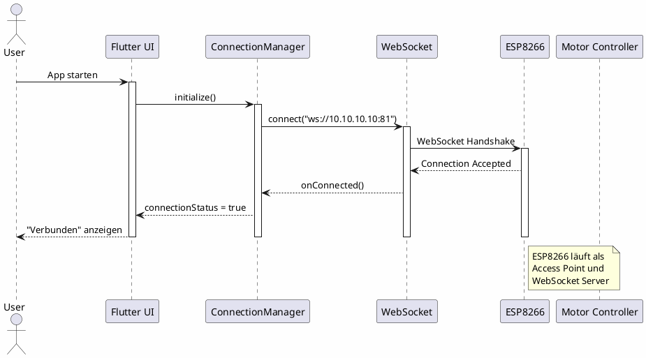
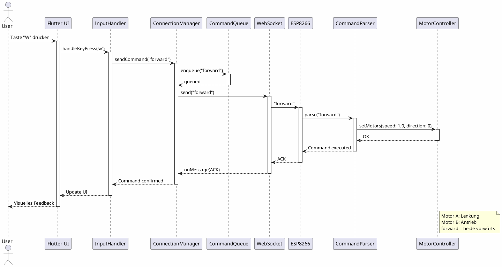
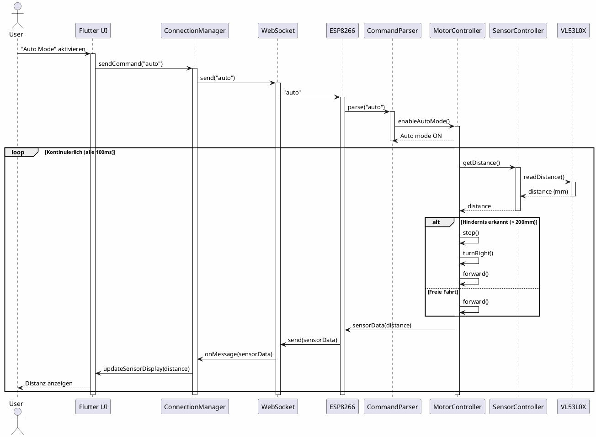
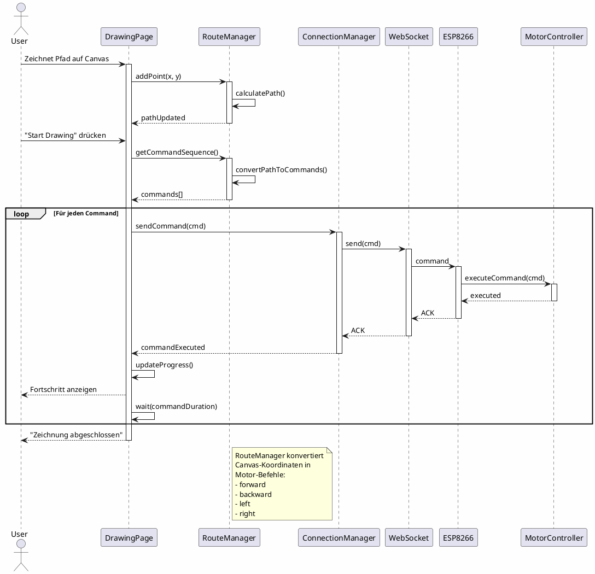
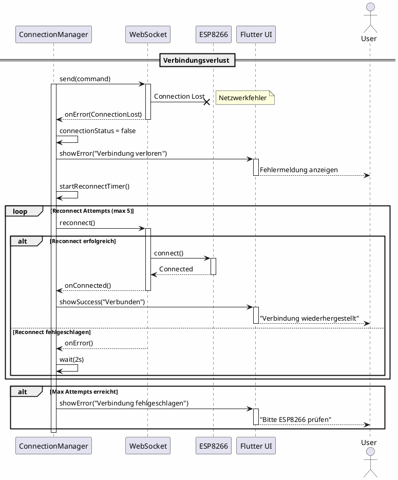
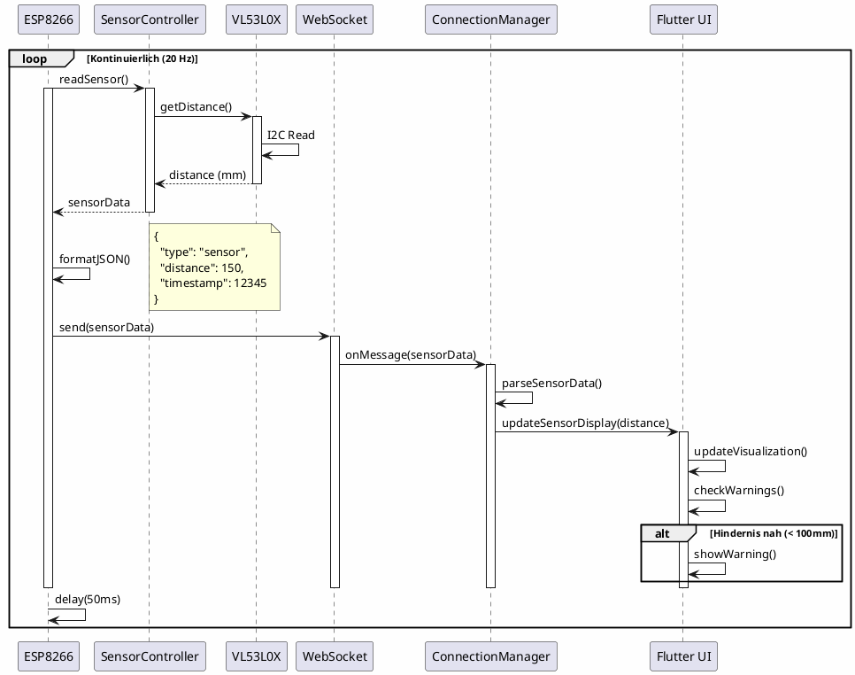

# Sequenzdiagramme - R.E.D. Projekt

## Inhaltsverzeichnis
- [Übersicht](#übersicht)
- [1. Verbindungsaufbau](#1-verbindungsaufbau)
- [2. Manuelle Steuerung](#2-manuelle-steuerung)
- [3. Autonomes Fahren](#3-autonomes-fahren)
- [4. Zeichenmodus](#4-zeichenmodus)
- [5. Fehlerbehandlung](#5-fehlerbehandlung)
- [6. Sensor-Datenübertragung](#6-sensor-datenübertragung)

## Übersicht

Diese Sequenzdiagramme zeigen die zeitliche Abfolge der Interaktionen zwischen den verschiedenen Komponenten des R.E.D. Systems.

## 1. Verbindungsaufbau

## 2. Manuelle Steuerung

## 3. Autonomes Fahren

## 4. Zeichenmodus

## 5. Fehlerbehandlung

## 6. Sensor-Datenübertragung

---

## Legende

| Symbol | Bedeutung |
|--------|-----------|
| → | Synchroner Aufruf |
| --> | Rückgabe |
| -x | Fehler/Abbruch |
| activate/deactivate | Komponente aktiv |
| loop | Wiederholte Ausführung |
| alt/else | Bedingte Ausführung |
| note | Zusätzliche Information |

---

**Letzte Aktualisierung**: 2026-05-26