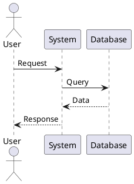

# Test-Ausführung Anleitung - R.E.D. Projekt

## 📋 Inhaltsverzeichnis
- [Voraussetzungen](#voraussetzungen)
- [Flutter Tests ausführen](#flutter-tests-ausführen)
- [ESP8266 Tests ausführen](#esp8266-tests-ausführen)
- [Diagramme visualisieren](#diagramme-visualisieren)
- [Troubleshooting](#troubleshooting)

## ✅ Voraussetzungen

### Für Flutter Tests

```bash
# Flutter SDK installiert?
flutter --version

# Sollte zeigen: Flutter 3.10.0 oder höher
```

### Für ESP8266 Tests

```bash
# PlatformIO installiert?
pio --version

# Oder Arduino IDE mit ESP8266 Board Package
```

### Für Diagramme

- **VS Code Extension**: PlantUML (von jebbs)
- **Oder Online**: http://www.plantuml.com/plantuml/uml/

---

## 🧪 Flutter Tests ausführen

### Schritt 1: Projekt vorbereiten

```bash
# In Flutter-Verzeichnis wechseln
cd Flutter

# Dependencies installieren
flutter pub get
```

### Schritt 2: Alle Tests ausführen

```bash
# Alle Tests ausführen
flutter test

# Erwartete Ausgabe:
# 00:02 +15: All tests passed!
```

### Schritt 3: Spezifische Tests ausführen

```bash
# Nur Physics Tests
flutter test test/unit/physics_test.dart

# Nur Connection Manager Tests
flutter test test/unit/connection_manager_test.dart

# Mit ausführlicher Ausgabe
flutter test --verbose
```

### Schritt 4: Test Coverage generieren

```bash
# Coverage-Report erstellen
flutter test --coverage

# HTML-Report generieren (benötigt lcov)
# macOS/Linux:
genhtml coverage/lcov.info -o coverage/html
open coverage/html/index.html

# Windows:
# Installiere lcov für Windows oder nutze VS Code Extension "Coverage Gutters"
```

### Schritt 5: Tests in VS Code ausführen

1. Öffne eine Test-Datei (z.B. `physics_test.dart`)
2. Klicke auf "Run" über der `main()` Funktion
3. Oder nutze Command Palette: `Flutter: Run Tests`

### Erwartete Ausgabe

```
✓ Physics Engine Tests Speed calculation - acceleration
✓ Physics Engine Tests Speed calculation - deceleration with friction
✓ Physics Engine Tests Speed clamping - max positive speed
✓ Physics Engine Tests Speed clamping - max negative speed
✓ Physics Engine Tests Steering calculation - left turn
✓ Physics Engine Tests Steering calculation - right turn
✓ Physics Engine Tests Steering return to center
✓ Physics Engine Tests RPM calculation from speed
✓ Physics Engine Tests Gear calculation - forward
✓ Physics Engine Tests Gear calculation - reverse
✓ Physics Engine Tests Gear calculation - neutral
✓ Physics Engine Tests Brake to reverse transition
✓ Physics Engine Tests Emergency brake - immediate stop
✓ Physics Engine Tests Combined acceleration and steering
✓ Physics Engine Tests Speed text formatting
✓ Physics Engine Tests RPM text formatting

All tests passed!
```

---

## 🔧 ESP8266 Tests ausführen

### Schritt 1: Hardware vorbereiten

1. **ESP8266 mit USB verbinden**
2. **Motoren anschließen** (für Motor-Tests)
3. **VL53L0X Sensor anschließen** (für Sensor-Tests)

### Schritt 2: PlatformIO Tests

```bash
# In CPP-Verzeichnis wechseln
cd CPP

# Alle Tests ausführen
pio test

# Spezifischen Test ausführen
pio test -f test_motors
pio test -f test_sensor

# Mit ausführlicher Ausgabe
pio test -v

# Auf spezifischem Port (falls mehrere ESP8266 angeschlossen)
pio test --upload-port /dev/ttyUSB0  # Linux/macOS
pio test --upload-port COM3          # Windows
```

### Schritt 3: Tests mit Arduino IDE

1. **Test-Datei öffnen**: `CPP/test/test_motors.cpp`
2. **Board auswählen**: Tools → Board → ESP8266 Boards → NodeMCU 1.0
3. **Port auswählen**: Tools → Port → (dein ESP8266 Port)
4. **Upload**: Klicke auf Upload-Button
5. **Serial Monitor öffnen**: Tools → Serial Monitor (115200 baud)

### Erwartete Ausgabe (Motor Tests)

```
=== Motor Tests ===
test_motor_pins_initialization...OK
test_motor_stop...OK
test_motor_forward...OK
test_motor_backward...OK
test_motor_turn_left...OK
test_motor_turn_right...OK
test_motor_forward_left...OK
test_motor_forward_right...OK
test_motor_backward_left...OK
test_motor_backward_right...OK
test_motor_sequence...OK
test_motor_rapid_commands...OK
test_motor_invalid_direction...OK
test_motor_invalid_turn...OK

14 Tests 0 Failures 0 Ignored
OK
```

### Erwartete Ausgabe (Sensor Tests)

```
=== VL53L0X Sensor Tests ===
test_sensor_initialization...OK
test_sensor_i2c_connection...
Found I2C device at 0x29
OK
test_sensor_single_reading...
Reading: 450 mm
OK
test_sensor_multiple_readings...
Reading 0: 445 mm
Reading 1: 448 mm
Reading 2: 450 mm
Reading 3: 447 mm
Reading 4: 449 mm
OK
test_sensor_range_validity...OK
test_sensor_timeout_handling...OK
test_sensor_rapid_readings...OK
test_sensor_long_range_mode...OK
test_sensor_high_speed_mode...OK
test_sensor_consistency...
Average distance: 448 mm
OK
test_autonomous_distance_logic...
Distance 100 mm -> Backward
Distance 200 mm -> Backward
Distance 300 mm -> Forward
Distance 500 mm -> Forward
Distance 1000 mm -> Forward
OK
test_sensor_error_recovery...OK

12 Tests 0 Failures 0 Ignored
OK
```

---

## 📊 Diagramme visualisieren

### Methode 1: VS Code Extension (Empfohlen)

1. **Extension installieren**:
   - Öffne VS Code
   - Extensions (Ctrl+Shift+X)
   - Suche "PlantUML"
   - Installiere "PlantUML" von jebbs

2. **Java installieren** (falls nicht vorhanden):
   ```bash
   # macOS
   brew install openjdk
   
   # Windows
   # Download von https://www.oracle.com/java/technologies/downloads/
   
   # Linux
   sudo apt install default-jdk
   ```

3. **Graphviz installieren**:
   ```bash
   # macOS
   brew install graphviz
   
   # Windows
   choco install graphviz
   
   # Linux
   sudo apt install graphviz
   ```

4. **Diagramm anzeigen**:
   - Öffne eine .md Datei mit PlantUML-Code (z.B. `Architektur.md`)
   - Drücke `Alt+D` (oder `Cmd+D` auf macOS)
   - Oder: Rechtsklick → "Preview Current Diagram"

### Methode 2: Online-Tool

1. Gehe zu: http://www.plantuml.com/plantuml/uml/
2. Kopiere den PlantUML-Code aus den Dokumentations-Dateien
3. Füge ihn in das Online-Tool ein
4. Klicke "Submit"
5. Diagramm wird angezeigt

**Beispiel**: Kopiere diesen Code:



### Methode 3: Lokale PlantUML Installation

```bash
# PlantUML JAR herunterladen
wget https://sourceforge.net/projects/plantuml/files/plantuml.jar/download -O plantuml.jar

# Diagramm generieren
java -jar plantuml.jar Dokumentation/Architektur.md

# PNG-Dateien werden im selben Verzeichnis erstellt
```

### Diagramm-Dateien im Projekt

Alle Diagramme befinden sich in:
- `Dokumentation/Architektur.md` - Systemarchitektur, Komponenten, Deployment
- `Dokumentation/Sequenzdiagramme.md` - Ablaufdiagramme
- `Dokumentation/Klassendiagramme.md` - UML-Klassendiagramme
- `Dokumentation/Use-Cases-und-Aktivitaeten.md` - Use-Cases, Aktivitäten, Zustände

---

## 🔍 Troubleshooting

### Flutter Tests

#### Problem: "Undefined class 'ConnectionManager'"

**Lösung**:
```dart
// In test-Dateien: Korrekten Import-Pfad verwenden
import '../../lib/main.dart';  // Wenn main.dart in lib/ ist
// ODER
import '../../main.dart';      // Wenn main.dart im Flutter/ Root ist
```

#### Problem: "No tests found"

**Lösung**:
```bash
# Prüfe Verzeichnisstruktur
ls -la Flutter/test/

# Stelle sicher, dass test/ Verzeichnis existiert
mkdir -p Flutter/test/unit
```

#### Problem: Tests schlagen fehl

**Lösung**:
```bash
# Lösche Build-Cache
flutter clean
flutter pub get

# Führe Tests erneut aus
flutter test
```

### ESP8266 Tests

#### Problem: "Port not found"

**Lösung**:
```bash
# Liste verfügbare Ports auf
pio device list

# Oder in Arduino IDE: Tools → Port

# Nutze den korrekten Port
pio test --upload-port /dev/ttyUSB0  # Dein Port hier
```

#### Problem: "Upload failed"

**Lösung**:
1. Drücke FLASH-Button auf ESP8266 während Upload
2. Prüfe USB-Kabel (manche sind nur zum Laden)
3. Installiere CH340 Treiber (für NodeMCU)
4. Reduziere Upload-Geschwindigkeit:
   ```ini
   ; platformio.ini
   upload_speed = 115200  # Statt 921600
   ```

#### Problem: "Sensor not found"

**Lösung**:
1. Prüfe I2C-Verkabelung:
   - SDA → D6 (GPIO12)
   - SCL → D5 (GPIO14)
   - VIN → 3.3V
   - GND → GND

2. Teste I2C-Scanner:
   ```cpp
   Wire.begin(D6, D5);
   for(byte addr = 1; addr < 127; addr++) {
       Wire.beginTransmission(addr);
       if(Wire.endTransmission() == 0) {
           Serial.print("Found: 0x");
           Serial.println(addr, HEX);
       }
   }
   // VL53L0X sollte bei 0x29 sein
   ```

#### Problem: "Motor tests fail"

**Lösung**:
1. Prüfe Motor-Verkabelung
2. Prüfe Stromversorgung (Batterie geladen?)
3. Teste Motoren einzeln:
   ```cpp
   digitalWrite(Motor_A_white, HIGH);
   delay(1000);
   digitalWrite(Motor_A_white, LOW);
   ```

### Diagramme

#### Problem: "PlantUML preview not working"

**Lösung**:
1. Prüfe Java-Installation:
   ```bash
   java -version
   ```

2. Prüfe Graphviz-Installation:
   ```bash
   dot -version
   ```

3. Setze PlantUML-Server in VS Code Settings:
   ```json
   {
     "plantuml.server": "https://www.plantuml.com/plantuml"
   }
   ```

#### Problem: "Diagram too complex"

**Lösung**:
- Nutze lokale Installation statt Online-Tool
- Oder teile Diagramm in kleinere Teile auf

---

## 📝 Test-Checkliste

### Vor dem Testen

- [ ] Flutter SDK installiert und aktuell
- [ ] PlatformIO oder Arduino IDE installiert
- [ ] ESP8266 mit USB verbunden
- [ ] Hardware korrekt verkabelt
- [ ] Dependencies installiert (`flutter pub get`)

### Flutter Tests

- [ ] `flutter test` läuft ohne Fehler
- [ ] Physics Tests bestanden (16 Tests)
- [ ] Connection Manager Tests bestanden
- [ ] Coverage > 80%

### ESP8266 Tests

- [ ] Motor Tests bestanden (14 Tests)
- [ ] Sensor Tests bestanden (12 Tests)
- [ ] Alle Motoren funktionieren
- [ ] Sensor liefert gültige Werte

### Diagramme

- [ ] PlantUML Extension installiert
- [ ] Alle Diagramme können angezeigt werden
- [ ] Diagramme sind verständlich

---

## 🚀 Schnellstart

### Flutter Tests (5 Minuten)

```bash
cd Flutter
flutter pub get
flutter test
```

### ESP8266 Tests (10 Minuten)

```bash
cd CPP
pio test -f test_motors
pio test -f test_sensor
```

### Diagramme anzeigen (2 Minuten)

1. VS Code öffnen
2. `Dokumentation/Architektur.md` öffnen
3. `Alt+D` drücken
4. Diagramm wird angezeigt

---

## 📞 Hilfe benötigt?

Bei Problemen:
1. Prüfe [Troubleshooting](#troubleshooting)
2. Schaue in `Dokumentation/Technische-Dokumentation.md`
3. Prüfe GitHub Issues
4. Kontaktiere das Team

---

**Viel Erfolg beim Testen! 🎉**

**Letzte Aktualisierung**: 2026-05-26