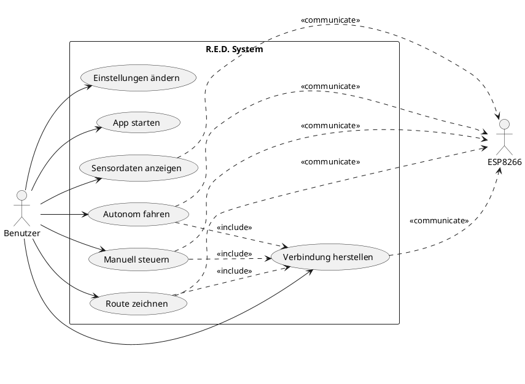
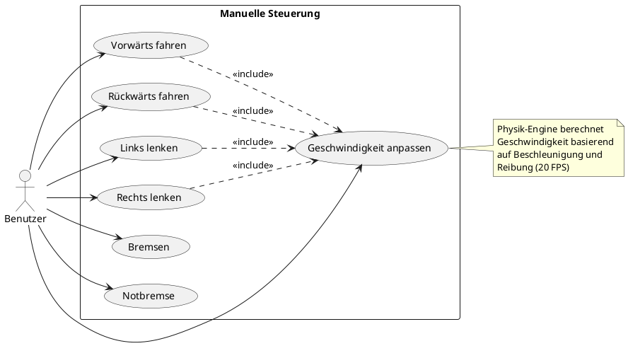
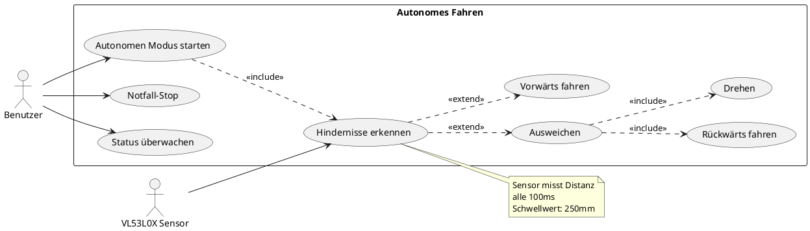
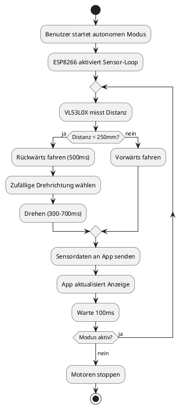
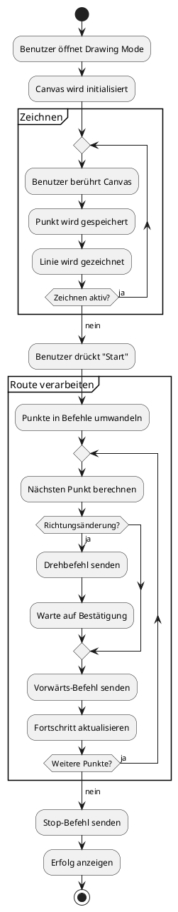

# Use-Case und Aktivitätsdiagramme - R.E.D. Projekt (Korrigierte Version)

## Inhaltsverzeichnis
- [Use-Case-Diagramm: Gesamtsystem](#use-case-diagramm-gesamtsystem)
- [Use-Case-Diagramm: Manuelle Steuerung](#use-case-diagramm-manuelle-steuerung)
- [Use-Case-Diagramm: Autonomes Fahren](#use-case-diagramm-autonomes-fahren)
- [Aktivitätsdiagramm: Autonomes Fahren](#aktivitätsdiagramm-autonomes-fahren)
- [Aktivitätsdiagramm: Drawing Mode](#aktivitätsdiagramm-drawing-mode)
- [Aktivitätsdiagramm: Verbindungsmanagement](#aktivitätsdiagramm-verbindungsmanagement)

## Use-Case-Diagramm: Gesamtsystem



## Use-Case-Diagramm: Manuelle Steuerung



## Use-Case-Diagramm: Autonomes Fahren



## Aktivitätsdiagramm: Autonomes Fahren



## Aktivitätsdiagramm: Drawing Mode



## Aktivitätsdiagramm: Verbindungsmanagement

```plantuml
@startuml

start

:App wird gestartet;

:ConnectionManager initialisieren;

:WebSocket-Verbindung aufbauen;

if (Verbindung erfolgreich?) then (ja)
  :Status auf "Connected" setzen;
  :Reconnect-Timer zurücksetzen;
  
  partition "Aktive Verbindung" {
    repeat
      :Auf Nachrichten warten;
      
      if (Nachricht empfangen?) then (ja)
        :Nachricht verarbeiten;
        :UI aktualisieren;
      endif
      
      if (Fehler aufgetreten?) then (ja)
        :Fehler loggen;
        :Verbindung trennen;
        stop
      endif
      
    repeat while (Verbindung aktiv?) is (ja)
    ->nein;
  }
  
else (nein)
  :Fehler anzeigen;
endif

:Reconnect-Timer starten;

:Warte (2^n Sekunden);

:Reconnect-Versuch;

if (Max. Versuche erreicht?) then (ja)
  :Fehler anzeigen;
  stop
else (nein)
  :Nächster Versuch;
  backward :WebSocket-Verbindung aufbauen;
endif

@enduml
```

---

## Use-Case-Beschreibungen

### UC1: App starten
**Akteure**: Benutzer  
**Vorbedingung**: App ist installiert  
**Nachbedingung**: App ist gestartet, Hauptmenü wird angezeigt  
**Hauptszenario**:
1. Benutzer öffnet die App
2. System lädt Konfiguration
3. System zeigt Hauptmenü mit drei Optionen

### UC2: Verbindung herstellen
**Akteure**: Benutzer, ESP8266  
**Vorbedingung**: ESP8266 ist eingeschaltet und im WLAN  
**Nachbedingung**: WebSocket-Verbindung ist aktiv  
**Hauptszenario**:
1. Benutzer wählt einen Fahrmodus
2. System baut WebSocket-Verbindung auf (ws://192.168.178.77:81)
3. ESP8266 bestätigt Verbindung
4. System zeigt "Connected" Status

**Alternativszenario**:
- 3a. Verbindung schlägt fehl
  - System startet Reconnect-Timer
  - System versucht erneut nach 2^n Sekunden

### UC3: Manuell steuern
**Akteure**: Benutzer  
**Vorbedingung**: Verbindung ist aktiv  
**Nachbedingung**: Fahrzeug hat sich bewegt  
**Hauptszenario**:
1. Benutzer drückt Taste (W/A/S/D)
2. System startet Physik-Engine
3. System sendet Befehle an ESP8266
4. ESP8266 steuert Motoren
5. System aktualisiert Geschwindigkeitsanzeige

### UC4: Autonom fahren
**Akteure**: Benutzer, VL53L0X Sensor  
**Vorbedingung**: Verbindung ist aktiv, Sensor funktioniert  
**Nachbedingung**: Fahrzeug fährt autonom  
**Hauptszenario**:
1. Benutzer startet autonomen Modus
2. ESP8266 aktiviert Sensor-Loop
3. System misst kontinuierlich Distanz
4. System weicht Hindernissen aus
5. System sendet Sensordaten an App

**Alternativszenario**:
- 3a. Sensor-Fehler
  - System zeigt Fehlermeldung
  - System stoppt autonomen Modus

### UC5: Route zeichnen
**Akteure**: Benutzer  
**Vorbedingung**: Verbindung ist aktiv  
**Nachbedingung**: Fahrzeug folgt gezeichneter Route  
**Hauptszenario**:
1. Benutzer zeichnet Route auf Canvas
2. System speichert Punkte
3. Benutzer startet Route
4. System konvertiert Punkte in Befehle
5. System sendet Befehle sequenziell
6. System zeigt Fortschritt

---

**Letzte Aktualisierung**: 2026-05-26
